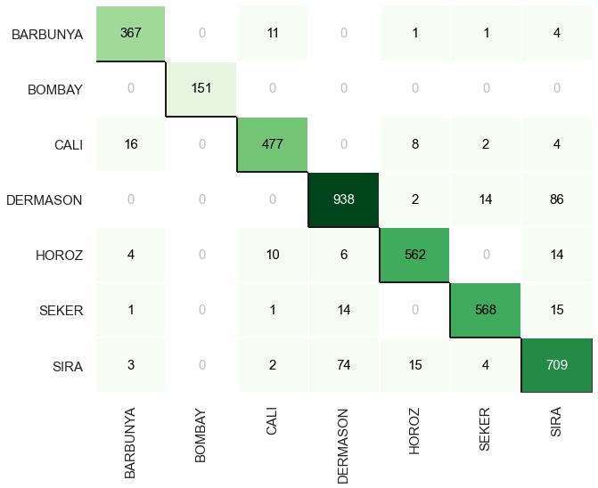
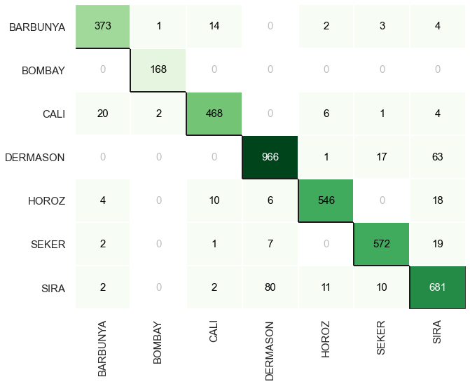
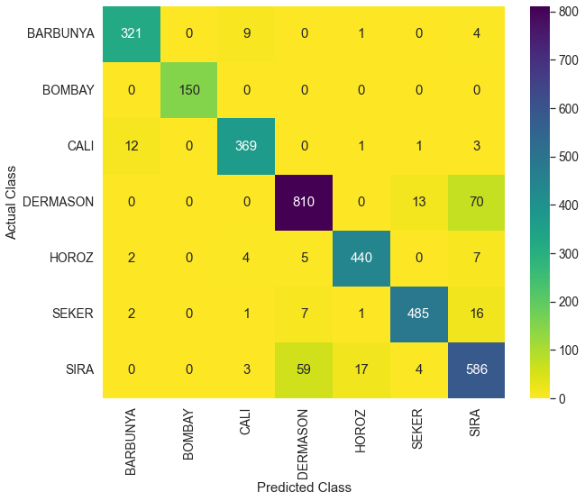

# Diploma Thesis

### App is deployed at: [DryBeanClassifer](https://share.streamlit.io/abhiswain97/diploma_thesis/app.py). Check it out !

- The app is deployed on share.streamlit.io.
- For making predictions using the `Vanilla_Net`, the tensorflow model is served at heroku container services using tensorflow serving.
- The app makes calls to the served model to get predictions.

<p align="center">
  
</p>


## What is the problem about?

  Dry bean is the most popular pulse produced in the world. The main problem dry bean
  producers and marketers face is in ascertaining good seed quality. Lower quality of
  seeds leads to lower quality of produce. Seed quality is the key to bean cultivation in
  terms of yield and disease. Manual classification and sorting of bean seeds is a difficult
  process. Our objective is to use Machine learning techniques to do the automatic
  classification of seeds.

## Why is this problem important to solve?

  Ascertaining seed quality is important for producers and marketers. Doing this manually
  would require a lot of effort and is a difficult process. This is why we try to use machine
  learning techniques to do the automatic classification of seeds.
  
## Business/Real-World impact of solving this problem?
  - Saves hours of manual sorting and classification of seeds.
  - We can do it in real-time.


## Table of Contents:

View the noteboks phase-wise following the links:

- [Data Acquisition](https://github.com/Abhiswain97/PGD_thesis/blob/master/Phase-1-Documentation-notebook.ipynb) 
- [EDA - Exploratory Data Analysis](https://github.com/Abhiswain97/PGD_thesis/blob/master/Phase-2-EDA.ipynb)
- [Feature Selection & Modelling](https://github.com/Abhiswain97/PGD_thesis/blob/master/Phase-3-Feature-Selection-and-Modelling%20.ipynb)
- [Advanced Modelling](https://github.com/Abhiswain97/PGD_thesis/blob/master/Phase-4-TF-NN.ipynb)

## Results

### Basic Modelling

- The best model we have is a *Light Gradient Boosting Classifer* on data with fixed imabalance. It has an accuracy of 93 % and a F1-score of 0.929

<p align="center">
  
</p>

- The second best model we have is a simple *Light Gradient Boosting Classifer* without any transforms tuned using Bayesian optimization for 25 iterations, to optimize `f1(weighted)` 
  ```
  {
    "bagging_fraction": 0.740705467313804,
    "bagging_freq": 2,
    "feature_fraction": 0.768581357957563,
    "learning_rate": 0.07351087677623395,
    "min_child_samples": 8,
    "min_split_gain": 0.308079603643812,
    "n_estimators": 132,
    "num_leaves": 109,
    "reg_alpha": 2.878849039397276,
    "reg_lambda": 2.7700803937357488e-08
  }
  ```
- It has an accuracy of 92.72 % and a f1-score of 0.927 

<p align="center">
  
</p>

### Advanced Modelling

- I used a 2 layer NN with relu activation.
  - The first hidden layer has 512 nodes
  - The second one has 256 nodes
  - Both the layers use `relu` activation
  - Optimizer: `Adam` with a `lr=3e-4`
  - loss: `SparseCategoricalCrossEntropy(logits=True)`
  - Epochs: 20

- With or without resampling: accuracy -> 93%, f1-score -> 0.933 

<p align="center">
  
</p>

## Using the the served model locally

### Serving the tensorflow model

You can directly serve the model and make api calls to get the predictions. Pre-requisite is just have docker installed

- Build the container `docker build -t app .`

- Run the container: `docker run -p 8501:8501 -e PORT=8501 app`
  
### Making predictions

- First, serve the model using the above instructions

- Next, in another terminal first install the requirements using: `pip install -r requirements.txt`

- The model is being served at `http://localhost:8501/saved_model`. To make predictions all you have to do is make calls to the endpoint: `http://localhost:8501/saved_model:predict`. A basic example of it is the `test_files/test_server.py`

- you can just run it: `cd test_files && python test_server.py` or use it as a template for your own application.

## Using the app locally

- Install all the requirements: `pip install -r requirements.txt`

- Now, just do: `streamlit run app.py` and voila it's up on local host! 
